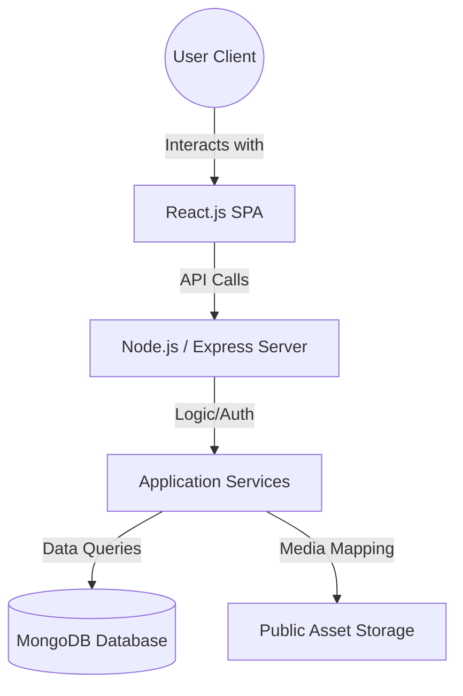
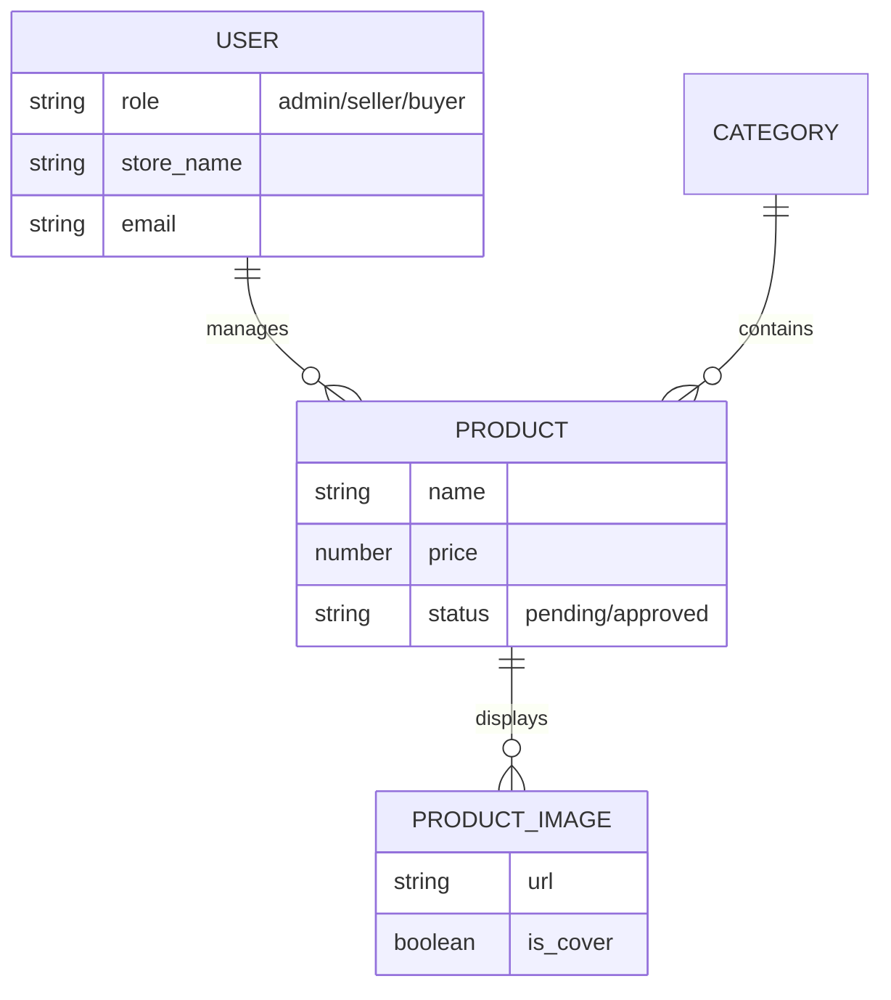

# WigVana: A Final Project Report
**MERN Stack E-commerce Application for the Ethiopian Wig Market**

---

## 1. Project Title
**WigVana** – A Comprehensive Online Marketplace for Premium Wigs and Hair Extensions.

## 2. Group Members
*To be filled by the student*
1. [Name] ([ID])
2. [Name] ([ID])
3. [Name] ([ID])

## 3. Problem Statement
The traditional wig and hair extension market in Ethiopia currently operates through fragmented physical stores and informal social media channels. This decentralization creates several significant challenges for both consumers and business owners:
*   **Market Fragmentation**: Customers often spend excessive time visiting multiple physical locations to find specific hair textures, lace types, or colors.
*   **Information Inconsistency**: There is no standardized way to compare product specifications such as hair origin (human vs. synthetic), length, or cap construction across different vendors.
*   **Lack of Centralized Moderation**: Without a dedicated platform, ensuring product quality and seller credibility is difficult, leading to a gap in consumer trust.
*   **Limited Digital Presence for Local Artisans**: Many high-quality local wig makers lack the technical infrastructure to reach a broader national audience.

## 4. Objectives
The primary objective of this project was to design and implement a fully functional, secure, and aesthetically pleasing MERN stack application that bridges the gap between hair product suppliers and consumers.
*   **Unified Platform**: To create a single digital destination where users can discover and compare diverse wig categories.
*   **Seller Empowerment**: To provide local businesses with a robust instrument for inventory management, order fulfillment, and store branding.
*   **Dynamic Resource Management**: To implement a system that efficiently serves high-quality media assets and detailed product metadata from a live database.
*   **Marketplace Quality Control**: To establish an administrative workflow that moderates product listings before they become visible to the public.

## 5. Functional and Non-Functional Requirements

### Functional Requirements
*   **User Identification & Security**: A multi-role authentication system that differentiates between Buyers, Sellers, and Administrators.
*   **Dynamic Inventory Discovery**: Real-time product listing with advanced search, category-based filtering, and price sorting.
*   **Seller Management Suite**: Comprehensive tools for sellers to manage the lifecycle of their products, including detailed variant configuration.
*   **Administrative Oversight**: A dedicated dashboard for platform moderators to review and approve product submissions to ensure quality standards.
*   **Automated Asset Linking**: A backend mechanism that automatically associates physical image files with database records for dynamic rendering.

### Non-Functional Requirements
*   **Premium User Experience**: A responsive and modern interface built with professional-grade design tokens using the Material-UI library.
*   **System Responsiveness**: High-performance data retrieval using Mongoose lean queries and virtual field population.
*   **Data Integrity**: Persistent storage using MongoDB Atlas, ensuring that all product, user, and order information is securely stored and retrievable.
*   **Scalable Architecture**: A modular backend structure that allows for future expansion into mobile applications or additional payment gateways.

## 6. System Architecture (MERN Stack Overview)
WigVana utilizes the industry-standard MERN architecture to provide a high-performance, single-page application experience.

*   **MongoDB**: Acts as the non-relational database storing user profiles, product catalogs, and category hierarchies.
*   **Express.js**: Provides the routing framework and middleware for the backend API.
*   **React.js**: Manages the dynamic views, state, and user interactions on the client side.
*   **Node.js**: Serves as the runtime environment for the backend services.

## 7. System Features
*   **Admin-Approved Marketplace**: A distinctive feature where every product uploaded by a seller must be verified by an administrator, ensuring only high-quality items are shown.
*   **Dynamic Media Population**: Products automatically pull their respective images from the server storage using advanced Mongoose virtuals, eliminating the need for hardcoded paths.
*   **Context-Aware Navigation**: The interface shifts dynamically based on user roles (e.g., Sellers see product management options, while Admins see moderation tools).
*   **Intelligent Category Sync**: The platform handles complex hair categories (Natural, Synthetic, Lace Front, etc.) with real-time updates from the database.

## 8. Data Model (Entity Relationship)
The system is designed with a clear structure to handle the complex relationships between users, their products, and the media assets.

## 9. Database Collections Overview
The MongoDB database is organized into several key collections:
*   **Users**: Stores credentials, roles, and profile information.
*   **Products**: Contains product names, descriptions, prices, and approval statuses.
*   **Categories**: Defines the classification system for the marketplace.
*   **ProductImages**: Stores the paths to the high-quality assets served to the frontend.
*   **SellerProfiles**: Holds specific details about the vendor's digital storefront.

## 10. API Infrastructure
The application communicates through a structured REST API. Major endpoints include:
*   **Authentication**: Handling secure login and registration.
*   **Marketplace Services**: Public access to browsing and searching approved products.
*   **Seller Operations**: Authenticated routes for managing inventory and uploading assets.
*   **Moderation Services**: Administrative routes for product approval and system oversight.

## 11. Screenshots
*Space reserved for student to insert application screenshots*

### Home Page and Hero Section
*(Insert Screenshot Here)*

### Product Listing with Dynamic Filter
*(Insert Screenshot Here)*

### Seller Dashboard and Product Management
*(Insert Screenshot Here)*

### Admin Moderation Interface
*(Insert Screenshot Here)*

## 12. Conclusion & Recommendations
The WigVana project successfully demonstrates a full-scale migration from a frontend-only prototype to a dynamic, database-driven e-commerce environment. By centralizing the wig market and implementing strict quality controls, the platform provides a professional solution for both local sellers and their customers.

### Recommendations
*   **Payment Gateway Integration**: Future versions should integrate local mobile money services like TeleBirr or Chapa for real-time transactions.
*   **Advanced Personalization**: Implementing a recommendation engine based on user browsing history for a more personalized shopping experience.
*   **Native Mobile Development**: Expanding the platform into a native mobile app to provide push notifications for order updates and new arrivals.
